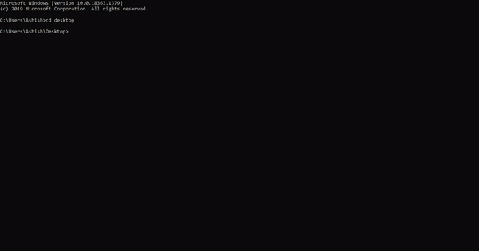

# pacman-Game

  

<h1 align="center">
  Pacman-Game
</h1>

    <a href="https://github.com/Ashish2030/pacman-Game" target="blank">View Demo</a>
    ·
    <a href="https://github.com/ashish2030/pacman-Game/issues/new/choose">Report Bug</a>
    ·
    <a href="https://github.com/ashish2030/pacman-Game/issues/new/choose">Request Feature</a>

